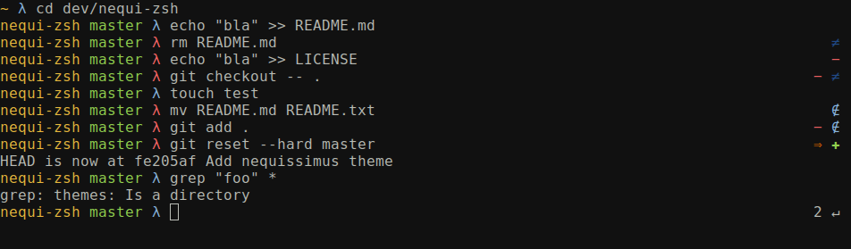

# nequi-zsh

Custom oh-my-zsh stuff

## Installation

Point `ZSH_CUSTOM` in `~/.zshrc` to this repository checkout

## Themes

### NeQuissimus

Simple theme with git status in the `RPROMPT` and a lambda symbol that changes colour if and when the git branch is dirty.
It also prints the return code if it is non-zero.

